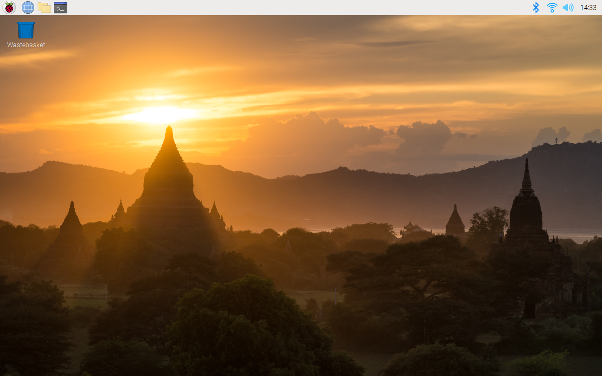
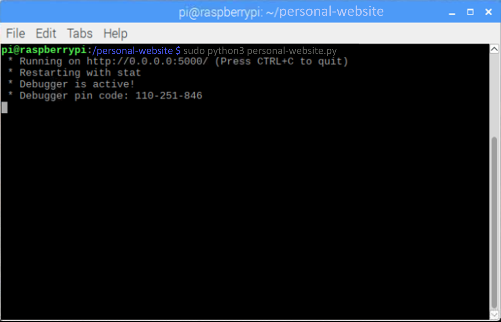

# Personal Website Guide

This is a guide showing the steps I took to make my personal website. I started the process of making a website several months ago, but I had problems following outdated and confusing guides. I trudged my way through several different guides and once I was done, I decided to make my own guide for those who end up in the same situation. 

## Part 1: Hardware

I chose to host my website on a raspberry pi 3. You can get them for relatively cheap price, and can always update later if you need more processing power for your server.

List of items I used:

1.) [Raspberry Pi 3 Model B](https://www.adafruit.com/product/3775?src=raspberrypi) \
2.) [Power Supply](https://www.adafruit.com/product/1995)\
3.) [Micro SD Card](https://www.amazon.com/Lexar-Micro-microSDXC-Memory-Adapter/dp/B09JNKHJ2Q/ref=sr_1_1_sspa?crid=1U2FUKCPAEENW&dib=eyJ2IjoiMSJ9.OpZe35jasjrIiod5BQLRghJ1B-vezANiAB-x9_gaWQ2QWcVSBmSjNuuIzSw5BfYBgDTBwveI-hnxVi5gjLfwJhRR1CjwuJ41onba1UEikHfOZ_IEfc8y7YjiE37JJC9B_QTsF8EalXyPH_bN1hl2C6GaBnzAYjblMcuFFf7HNoMKf6PuoiwtWpi6Vnr1l8uM7ydM2WhxuC-oVcxBquROatTQc6v9zuUzeUV-fR1DULizUU_QEtVbQM_EFS29wt_nDSRVDTvkOablYgLKwiUhPQRXCe6y6BAZgEmGpntNrQ4.nCtwTVkNOG6pwe3cXq83kch8LXcfHLBbQWK-tE81Je0&dib_tag=se&keywords=micro+sd+memory+card+and+adapter&qid=1710813911&s=pc&sprefix=micro+sd+memory+card+and+adabpte%2Ccomputers%2C165&sr=1-1-spons&sp_csd=d2lkZ2V0TmFtZT1zcF9hdGY&psc=1&smid=A23RK926ENO7O6) \
4.) Raspberry Pi 3 Model B case (I 3D-printed mine with this [model](https://www.thingiverse.com/thing:3719217)) \
5.) Computer equipment (monitor, mouse, keyboard)

## Part 2: Installing The Operating System

The brains of the Raspberry Pi are located in the Micro SD Card. The SD card comes blank, so it needs to be installed with the correct operating system in order to interact with the microchips on the pi. Head over to [Raspberrypi.com](https://www.raspberrypi.com/products/raspberry-pi-3-model-b/) to install the correct operating system for your pi. You will need to download the [Raspberry Pi Imager](https://www.raspberrypi.com/software/) to flash the operating system.

Once the operating system is installed and the pi boots up correctly, go through all the preferred settings (time zone, keyboard layout, etc.). You should now have a screen like this:



## Part 3: Installing And Setting Up The Server

There are several programs that can be used to host a server, but we are going to use Flask. Flask is an easy-to-use Python package that will handle network protocols and render HTML pages.

First, we must update our Pi. Open a terminal (the black square on the taskbar). Enter the commands and hit enter:

<span style="display: inline-block; padding: 5px; padding-right: 50px;  background-color: black;">
    <span style="font-weight: bold; color: white;">sudo apt update</span>
    <br>
    <span style="font-weight: bold; color: white;">sudo apt full-upgrade</span>
</span>

\
*Fun Fact: "sudo" runs a program with elevated administrator rights. If you ever run into a incefficent credentials problem, using sudo will work 9/10 of the time.*

Once updated and installed, we can download and make a Flask server. Open Thonny (should installed by deafult on Raspberry Pi). Thonny is a bare-bones Python IDE. Open the terminal by clicking "view" and select "Shell" and enter 

<span style="display: inline-block; padding: 5px; padding-right: 50px;  background-color: black;">
    <span style="font-weight: bold; color: white;">pip3 install Flask
    </span>
    <br>
    <span style="font-weight: bold; color: white;">flask --version 
    </span>
</span>

Flask is now installed. Close the python terminal and go back to the main terminal (the black box on the taskbar). We need to make a directory to hold all the contents for the server. Navigate to the desktop folder using the **cd** command. I created named my directory *personal_website* by using:

<span style="display: inline-block; padding: 5px; padding-right: 50px;  background-color: black;">
    <span style="font-weight: bold; color: white;">mkdir personal_website
    </span>
</span>

Navigate into the folder via the terminal by:

<span style="display: inline-block; padding: 5px; padding-right: 50px;  background-color: black;">
    <span style="font-weight: bold; color: white;">cd personal_website
    </span>
</span>

Within this directory, make a new Python file with Thonny called *personal_website.py*. Copy and paste this code into the new file:

```python
from flask import Flask

app = Flask(__name__)

@app.route('/')
def index():
    return 'Hello world'

if __name__ == '__main__':
    app.run(debug=True, host='0.0.0.0')
```

If all goes well, go back to the Pi terminal and enter 

<span style="display: inline-block; padding: 5px; padding-right: 50px;  background-color: black;">
    <span style="font-weight: bold; color: white;"> sudo python3 personal_website.py
    </span>
</span>

\ 
and the resulting output will be something similar to: 


